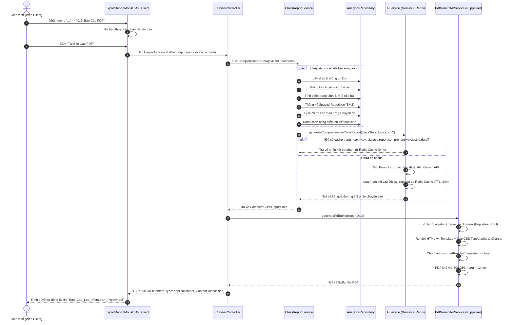

# Kiến Trúc & Luồng Xử Lý Xuất Báo Cáo Toàn Diện Lớp Học (PDF Server-Side)

> **Tác giả:** Hệ thống Quản lý Học tập Đa Nền tảng  
> **Phiên bản:** 1.0  
> **Cập nhật:** 24/08/2026  

---

## 1. Tổng Quan Hệ Thống

Tính năng **"Xuất Báo Cáo Toàn Diện Lớp Học (PDF)"** được xây dựng theo mô hình **Server-Side PDF Rendering**. Toàn bộ quá trình tổng hợp số liệu phân tích, gọi AI đánh giá sư phạm, dựng đồ thị biểu đồ và render văn bản in ấn A4 được thực hiện trực tiếp tại Backend (Node.js + Chromium Headless/Puppeteer), đảm bảo tính toàn vẹn dữ liệu, hiệu năng cao và chất lượng xuất bản 300 DPI chuẩn in ấn.

```
+------------------+         HTTP Request (GET)         +----------------------+
|  Teacher Web UI  | =================================> |  API Gateway/Routes  |
+------------------+                                    +----------------------+
        ^                                                          |
        |                                                          v
        | File Stream (PDF Buffer)                      +----------------------+
        +---------------------------------------------- |  Classes Controller  |
                                                        +----------------------+
                                                                   |
                                                                   v
                                                        +----------------------+
                                                        | Class Report Service |
                                                        +----------------------+
                                                          /        |         \
                                                         /         |          \
                                                        v          v           v
                                                  +-----------+ +-----+ +---------------+
                                                  | Analytics | | AI  | | PDF Generator |
                                                  |   Repo    | | Svc | |    Service    |
                                                  +-----------+ +-----+ +---------------+
                                                                   |            |
                                                            Redis Cache     Puppeteer
                                                            & Gemini AI     & Chart.js
```

---

## 2. Luồng Xử Lý Chi Tiết (Step-by-Step Flow)



---

## 3. Các Thành Phần Cốt Lõi (Architecture Components)

### 3.1. Singleton Puppeteer Browser Pool (`apps/api/src/lib/puppeteer.ts`)
- **Mục tiêu**: Giảm thiểu chi phí khởi động process Chromium cho mỗi request.
- **Cơ chế**:
  - Duy trì 1 phiên bản `Browser` singleton trong bộ nhớ.
  - Tự động dò tìm đường dẫn Chrome/Edge cài đặt sẵn trên máy chủ Windows (`C:\Program Files\...`, `C:\Program Files (x86)\...`) hoặc binary Chrome trên Linux/Docker container.
  - Sử dụng các cờ tối ưu hóa RAM (`--no-sandbox`, `--disable-setuid-sandbox`, `--disable-dev-shm-usage`, `--disable-gpu`).
  - Hỗ trợ giải phóng tiến trình an toàn khi server shutdown (`closeBrowserInstance`).

### 3.2. AI Pedagogical Assessment Service (`apps/api/src/modules/ai/ai.service.ts`)
- **Prompt Sư phạm học thuật**:
  - Nghiêm cấm sử dụng emoji, icon hoặc từ ngữ suồng sã.
  - Đóng vai trò là Hội đồng Cố vấn Sư phạm phân tích chuyên sâu 3 khía cạnh:
    1. **Nhận định tổng quan năng lực học tập** (`executive_summary`).
    2. **Phân tích lỗ hổng kiến thức và kỹ năng trọng tâm** (`strengths_and_weaknesses`).
    3. **Đánh giá mức độ ghi nhớ kiến thức dài hạn theo mô hình lặp lại ngắt quãng** (`sm2_learning_analysis`).
- **Chiến lược Caching**:
  - Khóa Redis `ai:class-report:comprehensive:${classId}:${todayStr}` với thời hạn 24 giờ.
  - Tránh chi phí và độ trễ gọi LLM lặp lại nhiều lần trong cùng một ngày.

### 3.3. Dịch Vụ Tổng Hợp Dữ Liệu Lớp Học (`apps/api/src/modules/classes/class-report.service.ts`)
- Sử dụng `Promise.all` để chạy đồng thời các truy vấn phân tích:
  - Sĩ số và mức độ hoạt động trong 7 ngày gần nhất.
  - Tỷ lệ hoàn thành bài tập và điểm số trung bình.
  - Thống kê 4 phân nhóm Spaced Repetition (Thành thạo, Đang rèn luyện, Cần ôn tập gấp, Kiến thức mới).
  - Tỷ lệ chính xác theo từng chuyên đề kiến thức.
  - Bảng điểm và tiến độ học tập chi tiết của từng học sinh.

### 3.4. Template Engine & In Ấn Vector Khổ A4 (`apps/api/src/modules/classes/templates/`)
- **`report.css.ts`**:
  - Thiết lập `@page { size: A4 portrait; margin: 12mm 14mm 14mm 14mm; }`.
  - Tỷ lệ font chữ lớn, rõ nét (`12.5pt - 13pt` nội dung, `21pt` tiêu đề chính).
  - Quy tắc ngắt trang `page-break-after: always;` giữa các phần và `page-break-inside: avoid;` chống vỡ hàng trên bảng điểm.
  - Header bảng điểm tự động lặp lại khi sang trang mới (`thead { display: table-header-group; }`).
- **`class-report.template.ts`**:
  - **Trang 1**: Header thông tin hành chính, 4 thẻ KPI chỉ số cốt lõi và Khối đánh giá sư phạm từ AI.
  - **Trang 2**: Hệ thống 2 biểu đồ Chart.js xếp chồng 100% full-width:
    1. Biểu đồ cột ngang (Horizontal Bar Chart) đo độ chính xác theo Chuyên đề kiến thức.
    2. Biểu đồ tròn (Doughnut Chart) đo phân bố mức độ ghi nhớ kiến thức dài hạn.
  - **Trang 3+**: Bảng tổng hợp chi tiết học sinh (Gradebook) có cột **"Kiến thức thành thạo"**.

### 3.5. Frontend Integration (`apps/web/src/features/teacher/class-detail/`)
- **`ClassHeader.tsx`**: Nút chức năng nằm tinh gọn trong menu `...` (độ rộng `w-52`).
- **`ExportReportModal.tsx`**: Hộp thoại xác nhận tải báo cáo với thông tin lớp học và trạng thái loading trực quan.
- **`teacherClassDetailApi.ts`**: Nhận binary blob từ API và kích hoạt tải file trực tiếp trên trình duyệt.

---

## 4. Danh Sách Endpoint Mới

| Phương thức | Đường dẫn | Quyền hạn | Mô tả |
| :--- | :--- | :--- | :--- |
| `GET` | `/api/v1/classes/:id/report/pdf` | `Teacher / Admin` | Tạo và tải file PDF báo cáo toàn diện của lớp học. |
| `GET` | `/api/v1/classes/:id/report/data` | `Teacher / Admin` | Trả về JSON dữ liệu phân tích và đánh giá AI để preview. |

---

## 5. Danh Sách File Liên Quan

1. `apps/api/src/lib/puppeteer.ts` - Singleton browser instance manager.
2. `apps/api/src/lib/__tests__/puppeteer.test.ts` - Test suite khởi tạo headless browser.
3. `apps/api/src/modules/ai/ai.service.ts` - AI assessment generator.
4. `apps/api/src/modules/ai/__tests__/ai.report.test.ts` - Test suite AI report & caching.
5. `apps/api/src/modules/classes/class-report.service.ts` - Dịch vụ tổng hợp số liệu lớp học.
6. `apps/api/src/modules/classes/__tests__/class-report.service.test.ts` - Test suite ClassReportService.
7. `apps/api/src/modules/classes/pdf-generator.service.ts` - Dịch vụ Puppeteer render PDF.
8. `apps/api/src/modules/classes/__tests__/pdf-generator.test.ts` - Test suite xuất PDF.
9. `apps/api/src/modules/classes/templates/report.css.ts` - CSS in ấn A4 chuẩn in.
10. `apps/api/src/modules/classes/templates/class-report.template.ts` - HTML/Chart.js report template.
11. `apps/api/src/modules/classes/classes.controller.ts` - Controller endpoint xuất PDF.
12. `apps/api/src/modules/classes/classes.routes.ts` - Route khai báo PDF export.
13. `apps/web/src/features/teacher/class-detail/api/teacherClassDetailApi.ts` - Client API gọi tải PDF.
14. `apps/web/src/features/teacher/class-detail/components/ExportReportModal.tsx` - Modal xuất báo cáo.
15. `apps/web/src/features/teacher/class-detail/components/ClassHeader.tsx` - Menu dấu 3 chấm.
16. `apps/web/src/features/teacher/class-detail/index.tsx` - State quản lý modal xuất PDF.
17. `apps/web/src/locales/vi.json` & `apps/web/src/locales/en.json` - Đa ngôn ngữ.
